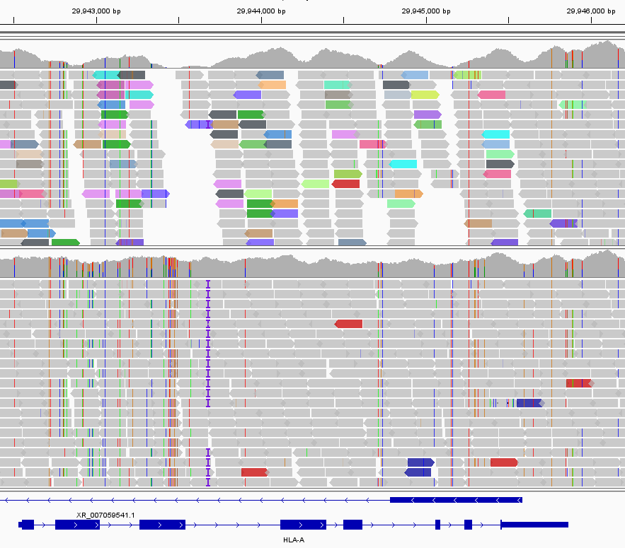

hla-mapper
=======
Version 4.5 (July 2024)

Author: Erick C. Castelli (erick.castelli@unesp.br)

Citation: Hla-mapper: Castelli EC et al. An application to optimize the mapping of HLA sequences produced by massively parallel sequencing procedures. Human Immunology, Volume 79, Issue 9, September 2018, Pages 678-684.

**Attention: hla-mapper support for KIR genes has been discontinued. KIR genes are now supported by another program, kir-mapper. [kir-mapper GitHub repo](https://github.com/erickcastelli/kir-mapper)**

## What is hla-mapper?

The polymorphic nature of most HLA genes and their high sequence similarity lead to read mapping bias and genotyping errors. hla-mapper was designed to minimize these issues. Based on a database of known HLA sequences, each read pair is scored and addressed to the most likely locus. The final output is a BAM file with reads mapped to the human reference genome (version hg38), allowing any downstream analysis that suits the user. The resulting BAM file is far more reliable than those generated by using BWA, Bowtie2, or other mapping tools directly.

## Summary


[What is hla-mapper](#what-is-hla-mapper)

[Important notes](#important-notes)

[Install](#install)

[-- Installing using conda](#installing-using-conda)

[-- Installing without conda](#installing-without-conda)

[hla-mapper configuration](#hla-mapper-configuration)

[Quick reference for hla-mapper usage](#quick-reference-for-hla-mapper-usage)

[-- hla-mapper functions](#hla-mapper-functions)

[-- Aligning reads to the hg38 reference genome](#aligning-reads-to-the-hg38-reference-genome)

[Practical notes](#practical-notes)

[Support](#support)


## Important notes:

Data compatibility: We tested hla-mapper with Illumina short-read data from whole-genome sequencing (WGS), whole-exome sequencing (WES), and targeted sequencing. It might work with Ion Torrent with some adjustments.

System compatibility: MacOS (Intel), Linux, or WSL2/Linux. We have tested it with MacOS 10.15, Ubuntu 22.04 LTS, and Ubuntu 22.04 LTS under WSL2. Other versions might be compatible. For MacOS, we tested only with Intel Macs.

Read depth: Please note that read depth is essential. We recommend coverage of at least 20x for WGS and 50x for WES. 

Read size: You will get much better results when dealing with a read size larger than 100 nucleotides and paired-end sequencing. hla-mapper is also compatible with single-end sequencing data. The pipeline might produced biases results with shorter reads ( < 100).

Always indicate the full path for any input file or output folder.

[Back to Summary](#summary)


## Install

hla-mapper depends on a list of libraries and third-party programs, including samtools, bcftools, freebayes, and others. In addition, it depends on some libraries such as ZLIB and BOOST. 

There are the programs and libraries necessary to use hla-mapper:

- boost >= 1.7
- cmake >= 3.26.4
- make >= 4.3
- zlib >= 1.2.13
- gcc/cpp compiler >= 11
- bwa 0.7.17
- freebayes 1.3.6
- samtools 1.19.2
- bcftools 1.19
- STAR 2.7.10b or 2.7.11a
- whatshap 2.2


### Installing using conda

To install hla-mapper and all its dependencies, use Conda and the hla-mapper.yml file, as follows.

**This tutorial assumes that you are using Miniconda (version 3). You can adapt it as necessary.**
**This tutorial assumes that your Miniconda install is on /home/USER/miniconda3. You can adapt it as necessary.**
**USER is your username**


1. If Conda/Bioconda is not installed, follow the [Bioconda installation instructions](https://bioconda.github.io/), with a preference for [Miniconda](https://docs.anaconda.com/free/miniconda/)

2. Make sure you added the proper channels:
```
	conda config --add channels defaults
	conda config --add channels bioconda
	conda config --add channels conda-forge
	conda config --set channel_priority true
```

3. Clone the [Kir-mapper GitHub repo](https://github.com/erickcastelli/hla-mapper)
```
	git clone https://github.com/erickcastelli/hla-mapper.git
```

4. Enter the kir-mapper repository.
```
	cd hla-mapper
```

5. Now, download the last version of the kir-mapper database:
```
	wget --no-check-certificate https://www.castelli-lab.net/support/hla-mapper_4_db_latest.zip
```

6. Unzip the database.
```
	unzip hla-mapper_4_db_latest.zip
```

7. Use conda to create an environment for kir-mapper using the kir-mapper.yml from the repository
```
	conda env create -f hla-mapper.yml
```

8. From the hla-mapper directory (you are already there), create a new folder named `build` and enter it.
```
	mkdir build && cd build
```

9. Now, activate the hla-mapper environment.
```
	conda activate hla-mapper
```

10. Compile hla-mapper from the /build folder
```
	BOOST_ROOT=/home/USER/miniconda3/envs/kir-mapper ZLIB_ROOT=/home/USER/miniconda3/envs/kir-mapper cmake ../src/
	make
```

11. Copy the hla-mapper binary to the /usr/bin, or /usr/local/bin, or folder /bin from your hla-mapper environment. Alternativelly, you can run `hla-mapper` from the build folder. 
```
	cp hla-mapper /home/USER/miniconda3/envs/hla-mapper/bin/
	or
	cp hla-mapper /usr/local/bin
```


12. Run hla-mapper. The setup process usually starts automatically. If it doesn't, you can call it by typing the following:
```
	hla-mapper
	or
	hla-mapper setup
```

13. Follow the setup steps. hla-mapper will automatically detect most programs (BWA, samtools, bcftools, freebayes, etc). The only exception is the path for the database (from step 5 and 6). 

14. You are all set. Don't forget to activate the hla-mapper environment before using it.
```
	conda activate hla-mapper
```

[Back to Summary](#summary)


<br/><br/>

### Installing without conda


To compile the program, assuming that everything above is available, follow these steps:

1. Clone the [hla-mapper GitHub repo](https://github.com/erickcastelli/hla-mapper)
```
	git clone https://github.com/erickcastelli/hla-mapper.git
```

2. Enter the hla-mapper repository
```
	cd hla-mapper
```

3. Create a new folder named `build` and enter it
```
	mkdir build && cd build
```

4. Compile the program
```
	cmake ../src/
	make
```

5. Now, download the last version of the kir-mapper database:
```
	wget --no-check-certificate https://www.castelli-lab.net/support/hla-mapper_4_db_latest.zip
```


6. Unzip the database.
```
	unzip hla-mapper_4_db_latest.zip
```

7. Run hla-mapper. The setup process usually starts automatically. If it doesn't, you can call it by typing the following:
```
	hla-mapper setup
```

8. Follow the setup steps. hla-mapper will automatically detect most programs if they are available in the system. The only exception is the path for the database. You can also indicate the path for each binary.


[Back to Summary](#summary)

<br/><br/>

## hla-mapper configuration

Remember, you need a copy of the hla-mapper database to run any analysis. 

```
	wget --no-check-certificate https://www.castelli-lab.net/support/hla-mapper_4_db_latest.zip
	unzip hla-mapper_4_db_latest.zip
```

hla-mapper uses a hidden configuration file (.txt) in your home folder containing the path for all necessary programs. If the program does not find this file, it enters the setup mode automatically. You can also call this mode by typing `hla-mapper setup` 

```
	hla-mapper setup
```

Follow the instructions provided to indicate the path of all necessary programs. hla-mapper might find the programs automatically. The only exception is the database. 

The setup process will save the configuration file in your home folder. This is an example of this file. You can edit it by using `nano ~/.hla-mapper`:

	db=/home/USER/apps/hla-mapper/hla-mapper_db_004.3_HLA
	samtools=/usr/bin/samtools
	bwa=/usr/bin/bwa
	whatshap=/home/USER/miniconda3/bin/whatshap
	freebayes=/usr/bin/freebayes
	blast=/usr/bin/blastn

[Back to Summary](#summary)

<br/><br/>

## Quick reference for hla-mapper usage

### hla-mapper functions

Running the program without any parameters will show all the functions available.

```
	hla-mapper
```

Currently, there are 3 functions:

- dna (for aligning reads from WGS, WES, and amplicons)
- setup (for configuring hla-mapper)
- select (for selecting HLA-like sequences) 

### Aligning reads to the hg38 reference genome

To call the dna function, run `hla-mapper dna`

	Usage: hla-mapper dna [OPTIONS]
	Required:
		sample=STRING: the name or identification for the sample
		r1=STRING and r2=STRING: path to paired-end read files
			 or
		r0=STRING: path to single-end read file
			 or
		bam=STRING: path to BAM file (reads aligned to the hg38 reference with BWA-MEM)
		
		
	Optional:
		output STRING: full path to the output folder.
		threads INT: number of threads
  		db          path to an hla-mapper database
  		output      output folder [default, folder hla-mapper next to the BAM/fastq file]
  		buffer      number of sequences in buffer [default: 1000000]
  		error       threshold for nucleotide quality trimming [default: 0.08]
  		tolerance   fraction of mismatches allowed [Default: 0.05, from 0.01 to 0.10]
  		downsample  downsampling for the adjustment procedure [default: 30]
  		--skip-unmapped   skip retrieving unmapped reads from BAM [not recommended]
  		--skip-adjust     skip the adjustment procedure [not recommended]
  		--low-mem         force low memory mode for sequence selection [not recommended]
  		--quiet           quiet mode


Example for the sample provided at the /test_sequences. This example contains reads from HLA-A. The HG01890_HLA-A.bam contains the reads aligned against the hg38+decoy reference genome (used by the 1000 Genomes project) using BWA-MEM.
```	
	# Re-aligning the BAM file
	hla-mapper dna bam=HG01890_HLA-A.bam sample=HG01890 output=/home/USER/output/HG01890 
	# Aligning FASTQ 
	hla-mapper dna r1=HG01890_HLA-A_R1.fastq r1=HG01890_HLA-A_R2.fastq sample=HG01890 output=/home/USER/output/HG01890  
```

You should indicate a different output folder for each sample.

The final BAM is the ".adjusted.bam". You can inspect/explore the BAM files using IGV.

This is an example of what to expect for HLA-A when aligning reads to the hg38 genome reference with BWA-MEM (upper panel) and after hla-mapper alignment (lower panel).



Upper panel: BWA-MEM + hg38. Lower panel: hla-mapper. BAM files visualized in IGV.

<br/><br/>

[Back to Summary](#summary)


## Practical notes

### Custom database, with alleles that are not in the IMGT/HLA database 
For now, it is not possible to add new alleles to hla-mapper. We will update the database regularly. Please contact the author if you need to add something.


## Support

Create a [GitHub issue](https://github.com/erickcastelli/hla-mapper/issues).

